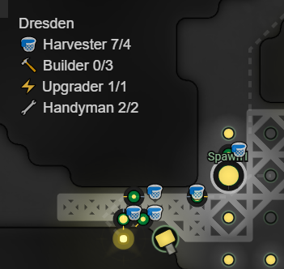
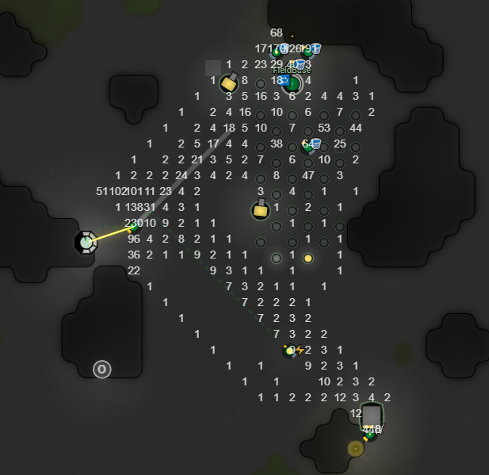

# Screeps Script

[](https://www.travis-ci.com/slothsoft/screeps-script)

My scripts for the game [Screeps](https://screeps.com/). The official API is located [here](https://docs.screeps.com/api).

- [Features](#features)
    - [Creeps](#creeps)
        - [Explorer](#explorer)
    - [Roads](#roads)
    - [Mayor](#mayor)
    - [Automatic Building](#automatic-building)
- [Console Commands](#console-commands)
- [Memory](#memory)
    - [Room Memory](#room-memory)
    - [Link Memory](#link-memory)
    - [Spawn Memory](#spawn-memory)
    - [Creep Memory](#creep-memory)
- [Dev Notes](#dev-notes)
- [Open Tasks](#open-tasks)




## Features

- each room has a fancy overview GUI
- each room has a console which prints most info


### Creeps

- will follow their role until there is nothing else to do
- if they don't find work in their role, they'll take on an arbitrary other role
- display their role next to their circle (→ `DEBUG_ROLES`)
- will be respawned with as many parts as possible after their death
- can self-destruct (console command `selfdestruct(<creepName>)`)

<p style="clear: both;" ></p>



#### Explorer

```js
spawnExplorer(<spawnId>, <flagName>)
```

An Explorer creeps will go through the following phases (it might skip one or more of them if they are no longer necessary):


| Phase              | Description Mode     |
| ------------------ | -------------------- |
| gotoFlagRoom       | creep walks into the room the flag ist in |
| claimFlagRoom      | creep walks to the controller and claims it |
| createSpawn        | creep creates a new construction side for a base on the flag |
| buildSpawn         | creep works as a Builder and constructs the spawn |
| retire             | creep gives up its role because it is no longer necessary |


### Roads

- the game will remember which tiles are heavily traveled by creeps
- this can be used to build roads, either automatically or manually
- to enable the view on the right, check the `roadManager` memory of a room

<p style="clear: both;" ></p>


### Mayor

- Mayor verifies that the base is in order and warns you
- optionally the mayor can fix some problems and help base building that way


| Warning            | Auto Mode            | Description  |
| ------------------ | -------------------- | -------------------- |
| Builder is missing. | Spawning Builder.  | If there is at least one construction site, the base needs at least one Builder to work correctly. |
| Handyman is missing. | Spawning Handyman.  | If there is at least one structure that needs repairing, the base needs a Handyman to work correctly. |
| Harvester is missing. | Spawning Harvester.  | The base needs at least one Harvester to work correctly. |
| Roads are missing. | I'm building roads.  | There are some well-traveled tiles without roads (set `room.memory.roadManager.visualize` to `true` to see which) |
| Upgrader is missing. | Spawning Upgrader.  | The base needs at least one Upgrader to work correctly. |


### Automatic Building

The `RoomManager` is used to build automatically one building site after the other. 

To configure what should be build, copy the memory of the `rooms.<room>.roomManager.layout` into an editor and replace the regex `(.{50})` with `$1\n` (this will make 50 lines of 50 chars out of the string, instead of the default 50 x 50 char long string. 

After changing the values, replace the line breaks with an empty string again.

The layout contains the following characters:

| Character                                           | Description  | Can be build?  |
| --------------------------------------------------- | ------------ | -------------- |
|   | plain | `false` |
| ~ | swamp | `false` |
| █ | wall | `false` |
| Ø | controller | `false` |
| © | mineral | `false` |
|  Ⓢ | source | `false` |
| o | extension | `false` |
| w | buildable wall |  `true` |
| r | rampart |  `true` |
| ? | unknown |  `false` |


## Console Commands

| Memory                                              | Description  |
| --------------------------------------------------- | ------------ |
| `clearConsole()`                               | clears the lines of the JavaScript and in-game consoles |
| `fetchOldestCreep(<baseName>)`             | fetches the oldest creep in the world (the one with the lowest `ticksToLive`); fetches the oldest creep in the base if &lt;baseName&gt; was set |
| `generateLayoutForRoom(<roomName>)`      | creates a editable room layout for the specific room name; overrides existing layouts |  
| `makeLinkSource(<id>)`                       | makes a link with a specific ID an source |
| `makeLinkTarget(<id>)`                       | makes a link with a specific ID an target |
| `moveCreepTo(<creepName>, <gameObjectId>)` | the creep will go to the game objects and start working there |
| `selfdestruct(<creepName>)`                 | the creep will go to the next spawn and recycle itself |
| `spawnCreepForRoom(<roomName>, <roleName>)` | spawns a new creep in a room with a specific role |
| `spawnExplorer(<spawnId>, <flagName>)`   | spawns a new explorer for a spawn ID and a flag name|
| `spawnMiner(<spawnId>, <sourceId>)`       | spawns a new miner for a spawn ID and a source ID |


## Memory

Documentation on which memory is used for which information. Mandatory elements are **bold**.


### Room Memory

| Memory                | Type          | Description  |
| --------------------- | ------------- | ------------ |
| base                  | `object`    | used to configure the base that started in this room |
| ..name                | `string`    | display name |
| ..outsourceSpawn      | `boolean`   | if `true`, another base will spawn creeps if this base has no free spawns |
| ..roleConfig          | `object`    | used to configure the creeps in this base |
| ....partsMinMultiplier| `number`    | used to configure how many parts new creeps have at least |
| ....partsMaxMultiplier| `number`    | used to configure how many parts new creeps have at most |
| ....showIcons         | `boolean`   | if `true`, shows icon on top of the creeps |
| ....useSourceAsSource | `boolean`   | if `true`, creeps that collect energy from somewhere will use sources as a source (set to `false` if other creeps mine sources) |
| ....useStorageAsSource| `boolean`   | if `true`, creeps that collect energy from somewhere will use storages as a source |
| ....&lt;role&gt;      | `object`    | used to configure a specific role in this base |
| ......requiredNumber  | `number`    | the required number of creeps for this role |
| console               | `object`    | used to collect config of the console & other GUI elements |
| ..height              | `number`    | height of the console in lines |
| ..x                   | `number`    | x coordinate to show the console at |
| ..y                   | `number`    | y coordinate to show the console at |
| ..roleInfoX           | `number`    | x coordinate to show the role info at |
| ..roleInfoY           | `number`    | y coordinate to show the role info at |
| roleInfo              | `object`    | **[Not for user!]** used to collect information about creeps on this room; _overwritten each round_ |
| ..&lt;role&gt;        | `object`    | used to collect information about the role with the name &lt;role&gt; |
| ....currentNumber     | `number`    | the current number of the role |
| ....requiredNumber    | `number`    | the required number of the role |
| ....symbol            | `number`    | the symbol of the role |
| roadManager           | `object`    | the configuration for the road manager |
| ..enabled             | `boolean`   | `false` to disable the road manager for this room |
| ..watchTime           | `number`    | number of ticks the road manager watches the room before deciding what to do |
| ..visualize           | `boolean`   | `true` to overlay the map with the count of used tiles (see [Roads](#roads)) |
| ..threshold           | `number `   | the threshold for how much a tile has to be used to validate a road |
| ..tick                | `number `   | **[Not for user!]** if _tick_ gets to _watchTime_ the tile information is stored for future use |
| ..currentTiles        | `string `   | **[Not for user!]** the used information for each tile that gets updated each tick |
| ..tick                | `number `   | **[Not for user!]** the information for each tile for the last _watchTime_ ticks |
| roomManager           | `object `   | the configuration for the room manager |
| ..debug               | `boolean`   | prints the room configuration to the screen |
| ..layout              | `string`    | contains the layout of the entire room's buildings (see [Automatic Building](#automatic-building)) |


### Structure Memory

Potential all structures can have some memory stored at `structures.<id>`. 

| Memory                | Type          | Description  |
| --------------------- | ------------- | ------------ |
| debug                 | `boolean`   | if `true`, the structure will print every time it does something |
| name                  | `string`    | human readable name, useful for error message or debugging |


### Link Memory

| Memory                | Type          | Description  |
| --------------------- | ------------- | ------------ |
| type                  | `string`    | `source` if link is a source, `target` if it is a target |
| transferId            | `string`    | sources and targets of a specific `transferId` are matched, so you can have multiple source→target pairs per room |


### Spawn Memory

| Memory                | Type          | Description  |
| --------------------- | ------------- | ------------ |
| debug                 | `boolean`   | if `true`, the spawn will print each time a creep is spawned |


### Creep Memory

| Memory                | Role          | Type          | Description  |
| --------------------- | ------------- | ------------- | ------------ |
| debug                 |               | `boolean`   | if `true`, the creep will print each tick what it is doing |
| **role**              |               | `string`    | the role this creep fulfills (if it is necessary) |
| **home**              |               | `string`    | the base this creep belongs too |
| moveToGameObject      |               | `string`    | a game object for the creep to walk to |
| selfdestruct          |               | `boolean`   | if `true`, the creep will go to the next spawn and recycle itself |
| source                |               | `string`    | the ID of the source the creep will use; all creeps will wait for this source to refill instead of searching for alternatives |
| target                |               | `string`    | the ID of the target the creep will prioritize; depending on the role the creeps will handle invalid targets differently: <ul><li><b>Builder, Handyman, Harvester & Storekeeper</b> will silently fallback to different targets</li><li><b>Courier & Miner</b> will wait till the target becomes valid again</li><li><b>Explorer & Upgrader</b> will print an error</li></ul> |


#### Miner Memory   

| Memory                | Type          | Description  |
| --------------------- | ------------- | ------------ |
| **source**            | `string`    | the source this miner is claiming |
| **homeSpawn**         | `string`     | the spawn that created this miner |
| initialTicksToLive    | `number`    | the `ticksToLive` this creep had initially |
| ticksToSource         | `number`    | the `ticksToLive` when this creep first reached the source|
| trainedReplacement    | `number`    | if the creep has already trained its replacement |


## Dev Notes

- Tests run against a mock of the original game: [mock folder](./test/mock)


### Courier Implementation

For the question how to implement couriers, two option present itself: routes stored for each room / base, or for each creep.

| Room                  | Creep Based           |
| --------------------- | --------------------- |
| ➕ the number of routes and couriers must not be identical | ➖ the number of couriers and routes should be identical |
| ➕ better option for respawning - especially if creeps get killed before spawning their replacement | ➖ creeps need to spawn their replacement before dying |
| ➕ information stays even if all creepy die  | ➖ information gets lost if creeps die unexpectedly |


## Open Tasks

- `Creep#dismantle` can be used for something
- spawn on new world and see what happens and what needs fixing, then document
- test the marked test classes (→ TODO)

_(See [Issues](https://github.com/slothsoft/screeps-script/issues))_